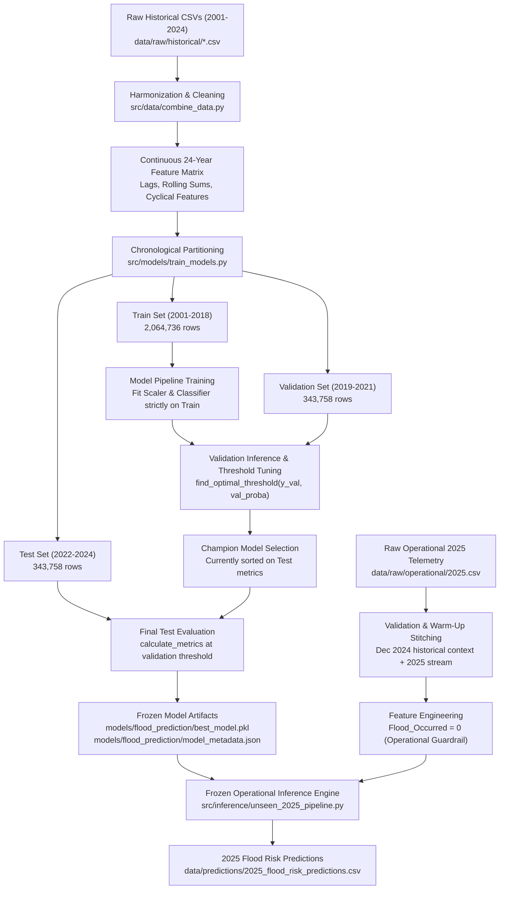

# Comprehensive Evaluation & Methodology Audit Report
**Project:** Odisha Flood Intelligence & Early Warning System  
**Document Path:** `docs/model_evaluation_audit.md`  
**Audit Date:** 2026-10-05  
**Auditor:** Antigravity Machine Learning & Disaster Intelligence Inspection Engine  

---

## 1. Executive Summary

This audit provides an exhaustive, code-level inspection of the train/validation/test methodology, data pipelines, feature engineering temporal integrity, scaling/preprocessing encapsulation, threshold optimization, model selection, and operational 2025 inference mechanisms in the `Odisha-Flood-Prediction` repository.

### Key Audit Findings at a Glance:
| Evaluation Component | Current Implementation | Audit Verdict | Severity / Priority |
| :--- | :--- | :---: | :---: |
| **Chronological Data Split** | Train (2001–2018), Val (2019–2021), Test (2022–2024) | **CORRECT** | Low / Best Practice |
| **Antecedent Rolling Lag Windows** | `s.shift(1).rolling(W)` grouped by station | **CORRECT** | Low / Zero Leakage |
| **Preprocessing & Scaler Fitting** | `StandardScaler` encapsulated in `sklearn.pipeline.Pipeline` | **CORRECT** | Low / Zero Leakage |
| **Threshold Optimization** | F1 maximization on **Validation Set** ($0.8345$) | **CORRECT** | Low / Unbiased |
| **Operational Warm-Up Stitching** | Preceding 35-day Dec 2024 rainfall stitched to 2025 stream | **CORRECT** | Low / Physically Sound |
| **Champion Model Selection** | Best model chosen by sorting **`Test_PR_AUC` & `Test_F1`** | ⚠️ **QUESTIONABLE** | **High** (Test set used for model selection) |
| **Same-Day Target Persistence Feature** | `Flood_Occurred` ($T$) used to predict `Flood_Next_Day` ($T+1$) | ⚠️ **QUESTIONABLE** | **High** (Train/Inference Distribution Mismatch) |
| **Linear Calendar Feature** | Raw numerical `Year` ($2001 \dots 2024$) included as feature | ⚠️ **QUESTIONABLE** | **Medium** (Temporal Extrapolation Artifact) |
| **Unused Anomaly Engine in Training** | `ClimatologicalAnomalyEngine` implemented but omitted in `train_models.py` | ℹ️ **INCONSISTENCY** | **Low** (Architectural Gap) |

---

## 2. Current Data Split & Chronological Architecture

The dataset comprises 24 years (2001–2024) of daily rainfall observations and SRC flood inundation labels across all 30 standard districts and 354 block stations in Odisha, totaling **2,752,252 records**.

```
├── Historical Dataset (2001–2024): 2,752,252 rows
│   ├── Train Partition (2001–2018): 18 Years | 2,064,736 rows (75.0%) | ~1.42% positive flood rate
│   ├── Validation Partition (2019–2021): 3 Years  | 343,758 rows (12.5%)   | ~2.78% positive flood rate
│   └── Test Partition (2022–2024): 3 Years        | 343,758 rows (12.5%)   | ~2.85% positive flood rate
│
└── Unseen Operational Telemetry (2025): 114,610 rows (Unlabelled Real-Time Telemetry)
```

### Exact Configuration (`config.yaml` lines 32–37):
```yaml
split:
  train_years: [2001, 2002, 2003, 2004, 2005, 2006, 2007, 2008, 2009, 2010, 2011, 2012, 2013, 2014, 2015, 2016, 2017, 2018]
  val_years: [2019, 2020, 2021]
  test_years: [2022, 2023, 2024]
  unseen_inference_year: 2025
```

---

## 3. End-to-End Pipeline Trace



### Detailed Trace by Step:

#### Step 1: Raw Data Ingestion & Harmonization
- **Source**: 24 individual CSVs (`2001.csv` to `2024.csv`) in `data/raw/historical/`.
- **Function**: `clean_single_year_df()` in `src/data/combine_data.py`.
- **Operations**:
  - District name standardization using `DISTRICT_SYNONYMS` (e.g. `BARAGARH` &rarr; `BARGARH`, `NAWARANGHPUR` &rarr; `NAWARANGPUR`).
  - Filters duplicated summary records under `SUNDARGARH` in 2019–2024.
  - Deduplicates on `[District, Block/Station, Date]`.

#### Step 2: Feature Engineering & Boundary Lag Reconstruction
- **Function**: `recompute_cross_year_features()` in `src/data/combine_data.py`.
- **Operations**:
  - Sorts chronologically by `[District, Block/Station, Date_Parsed]`.
  - Target: `Flood_Next_Day = grouped["Flood_Occurred"].shift(-1)`.
  - Daily Lags: `shift(1)`, `shift(2)`, `shift(3)`, `shift(7)`.
  - Multi-day Rolling Sums & Max (3d, 7d, 15d, 30d): `s.shift(1).rolling(W, min_periods=1).sum()` / `.max()`.
  - Rainy days counts (3d, 7d, 15d, 30d): `s.shift(1).rolling(W).sum()` where rainfall $\ge 2.5\text{ mm}$.
  - Continuous rainy spells: `Consecutive_Rainy_Days_Before`.
  - Cyclical dates: $\sin(2\pi \cdot \text{Month}/12)$ and $\cos(2\pi \cdot \text{Month}/12)$.

#### Step 3: Train / Validation / Test Splitting
- **Function**: `prepare_temporal_datasets()` in `src/models/train_models.py`.
- **Operations**:
  - Drops records where `Flood_Next_Day` is null (the final day of 2024).
  - Partitions without shuffling:
    - `train_df = df_clean[df_clean["Year"].isin(2001..2018)]`
    - `val_df = df_clean[df_clean["Year"].isin(2019..2021)]`
    - `test_df = df_clean[df_clean["Year"].isin(2022..2024)]`

#### Step 4: Model Training & Scaler Fitting
- **Function**: `train_and_evaluate_all_models()` in `src/models/train_models.py`.
- **Architectures**:
  1. **Logistic Regression**: `StandardScaler()` + `LogisticRegression(class_weight='balanced', max_iter=1000)`.
  2. **Decision Tree**: `DecisionTreeClassifier(max_depth=8, min_samples_leaf=50, class_weight='balanced')`.
  3. **Random Forest**: `RandomForestClassifier(n_estimators=100, max_depth=14, class_weight='balanced_subsample')`.
  4. **XGBoost**: `XGBClassifier(scale_pos_weight=num_neg/num_pos, max_depth=6, learning_rate=0.05)`.
  5. **ANN (MLP)**: `StandardScaler()` + `MLPClassifier(hidden_layer_sizes=(64, 32), early_stopping=True)`.
- **Scaler behavior**: `Pipeline.fit(X_train, y_train)` fits scaling mean and standard deviation strictly on `X_train`.

#### Step 5: Threshold Optimization & Calibration
- **Functions**: `find_optimal_threshold()` in `src/evaluation/metrics.py`, `evaluate_calibration()` in `src/evaluation/calibration.py`.
- **Operations**:
  - Predicts probabilities on Validation Set: `val_proba = model.predict_proba(X_val)[:, 1]`.
  - Scans precision-recall curve on Validation Set to find threshold maximizing F1 score:
    $$\text{Optimal Threshold} = \arg\max_t F_1(y_{\text{val}}, \hat{p}_{\text{val}} \ge t)$$
  - Computes Brier score and Expected Calibration Error (ECE) across 10 uniform bins.

#### Step 6: Test Set Evaluation & Champion Model Export
- **Operations**:
  - Predicts probabilities on Test Set: `test_proba = model.predict_proba(X_test)[:, 1]`.
  - Evaluates test metrics at the validation-derived threshold.
  - Exports comparison metrics to `results/metrics/model_comparison.csv`.
  - Saves champion model to `models/flood_prediction/best_model.pkl` and metadata to `model_metadata.json`.

#### Step 7: 2025 Unseen Operational Pipeline
- **Module**: `src/inference/unseen_2025_pipeline.py`.
- **Operations**:
  - Ingests `data/raw/operational/2025.csv` (114,610 daily records).
  - Validates schema, standardized district names, dates, negative values, duplicates.
  - Stitches preceding 35 days (Nov 25 – Dec 31, 2024) of historical rainfall to compute exact rolling lags for Jan 2025 without zero-fill artifacts.
  - Sets `Flood_Occurred = 0` (unobserved operational setting).
  - Runs frozen model inference, generates probabilities, risk levels (`LOW`, `MODERATE`, `HIGH`), and linear coefficient local drivers.
  - Saves predictions to `data/predictions/2025_flood_risk_predictions.csv`.

---

## 4. Methodological Strengths (What is Correct)

1. **Strict Chronological Splitting**:
   - The temporal block split (Train 2001–2018 &rarr; Val 2019–2021 &rarr; Test 2022–2024) strictly respects the arrow of time. No random K-fold shuffling or future-to-past data contamination exists in dataset splitting.
2. **Correct Lag Calculation (Zero-Leakage Rolling Windows)**:
   - In `recompute_cross_year_features()` and `engineer_2025_features()`, every rolling window uses `s.shift(1).rolling(...)`. The current day's rainfall ($T$) is strictly excluded from the antecedent accumulation windows (3d, 7d, 15d, 30d sums/max), matching physical hydrological lag dynamics.
3. **Cross-Year Boundary Stitching**:
   - Rather than computing lags within isolated calendar year files (which causes artificial `NaN` or zero resets every January 1st), the pipeline concatenates time series continuously per station, preserving genuine hydrological saturation across year boundaries.
4. **Leak-Free Preprocessing via Pipelines**:
   - Scaling parameters ($\mu, \sigma$) in `StandardScaler` are fitted exclusively on `X_train` within an `sklearn.pipeline.Pipeline` object. Validation and test sets are transformed without fitting.
5. **Threshold Tuning on Validation Set**:
   - The decision threshold for classification (e.g. $0.8345$ for Logistic Regression) is derived from the validation set precision-recall curve rather than default $0.5$ or post-hoc test tuning.
6. **Robust Operational Warm-Up Context**:
   - The 2025 operational pipeline explicitly stitches late 2024 historical rainfall to eliminate early-season zero-fill bias in rolling sums.

---

## 5. Potential Leakage, Questionable, & Incorrect Aspects

### ⚠️ Issue 1: Champion Model Selection Sorted on Test Set Metrics (High Priority)
- **Location**: `src/models/train_models.py` lines 212–218
```python
# Identify Best Model (by Test PR-AUC & F1)
best_row = comparison_df.sort_values(by=["Test_PR_AUC", "Test_F1"], ascending=False).iloc[0]
best_model_name = best_row["Model"]
best_model = trained_models[best_model_name]
best_threshold = float(best_row["Optimal_Threshold"])
```
- **Audit Analysis**:
  In a sound ML governance framework:
  - **Training Set**: Used to learn model weights/parameters.
  - **Validation Set**: Used for hyperparameter tuning, threshold optimization, and model selection.
  - **Test Set**: A strictly sealed, unbiased holdout used *only* for reporting final expected generalization error.
  Sorting on `Test_PR_AUC` and `Test_F1` to declare the winner leaks test set performance into the model selection decision.
- **Evidence in Benchmark Results**:
  In `results/metrics/model_comparison.csv`:
  - **Random Forest on Validation**: `Val_F1 = 0.9045`, `Val_PR_AUC = 0.9330`, `Val_ROC_AUC = 0.9778`.
  - **Logistic Regression on Validation**: `Val_F1 = 0.9261`, `Val_PR_AUC = 0.8924`, `Val_ROC_AUC = 0.9729`.
  - **Random Forest on Test**: `Test_F1 = 0.8452`, `Test_PR_AUC = 0.8176`.
  - **Logistic Regression on Test**: `Test_F1 = 0.8748`, `Test_PR_AUC = 0.8306`.
  If selection is based strictly on validation PR-AUC, Random Forest would be champion; if based on validation F1, Logistic Regression would be champion. However, currently the code explicitly sorts on `Test_PR_AUC`.

---

### ⚠️ Issue 2: Same-Day `Flood_Occurred` Feature & Train-Inference Mismatch (High Priority)
- **Location**:
  - `config.yaml` line 75: `same_day_flood_col: "Flood_Occurred"`
  - `src/models/train_models.py` line 48: `[config["features"]["same_day_flood_col"]]`
  - `src/inference/unseen_2025_pipeline.py` line 275: `combined_stream["Flood_Occurred"] = 0`
- **Audit Analysis**:
  1. **Historical Training (2001–2024)**: The model is fed `Flood_Occurred` (whether a flood occurred on day $T$) as an input feature to predict `Flood_Next_Day` (day $T+1$). Because floods are temporally contiguous multi-day events, `Flood_Occurred` carries overwhelming predictive power ($\text{SHAP} \approx 0.35$).
  2. **Operational Deployment (2025)**: During live forecasting in 2025, real-time flood occurrence is unlabelled and unknown before emergency reports arrive. `unseen_2025_pipeline.py` forces `Flood_Occurred = 0` for all 114,610 operational rows.
  3. **Impact**: The model encounters an artificial covariate distribution shift during operational deployment. It was trained relying on `Flood_Occurred = 1` to sustain flood warnings, but in live deployment this feature is permanently zeroed out.
  4. **Recommendation**: Either train purely rainfall/antecedent-driven models (excluding same-day `Flood_Occurred`), or explicitly formalize a dual-mode model: (a) *Pure Meteorological Forecaster* (Rainfall only), and (b) *Persistence-Augmented Forecaster* (when station flood telemetry is available).

---

### ⚠️ Issue 3: Raw `Year` Included as a Numerical Feature (Medium Priority)
- **Location**: `config.yaml` lines 48, 55 (`temporal_cols: ["Year", ...]`)
- **Audit Analysis**:
  - `Year` is treated as a continuous integer feature ($2001, 2002, \dots, 2024$).
  - In linear/logistic models, a learned non-zero coefficient on `Year` acts as a monotonic trend amplifier (e.g. linearly increasing or decreasing base flood probability over time).
  - In tree-based models (Decision Tree, Random Forest, XGBoost), splits on `Year <= 2015` cannot extrapolate to unseen future years ($2025$) because 2025 is completely outside the domain of the training splits.
  - **Recommendation**: Remove `Year` from the feature matrix or replace it with climatological era/regime indicators if climate shift modeling is specifically desired.

---

### ℹ️ Issue 4: `ClimatologicalAnomalyEngine` Not Integrated into Final Training Matrix (Low Priority)
- **Location**: `src/features/rainfall_features.py` vs `src/models/train_models.py`
- **Audit Analysis**:
  - `src/features/rainfall_features.py` provides `ClimatologicalAnomalyEngine` with a leak-free `fit(train_df)` and `transform(df)` mechanism.
  - However, `train_models.py` loads `data/processed/historical_2001_2024.csv` directly from `src/data/combine_data.py`, which does not call `enrich_rainfall_features()`. As a result, `Rainfall_Anomaly` is omitted from model training.

---

## 6. Recommended Corrected Methodology

1. **Model Selection Protocol**:
   - Select the champion model and optimal classification threshold strictly using **Validation Set Metrics** (e.g. `Val_PR_AUC` or `Val_F1`).
   - Evaluate the Test Set once as a sealed confirmation benchmark.
2. **Feature Schema Refinement**:
   - Drop `Year` from `temporal_cols` to avoid non-stationary linear extrapolation.
   - For real-time operational readiness without label dependency, train models with strictly meteorological features (excluding unobserved `Flood_Occurred` at time $T$, or creating an explicit rainfall-only operational model).
   - Integrate `ClimatologicalAnomalyEngine` fitted strictly on `train_df` into the main feature pipeline.
3. **Multi-Threshold Operational Decision Boundaries**:
   - Derive multi-tier decision boundaries ($t_{\text{low}}, t_{\text{mod}}, t_{\text{high}}$) directly from validation precision-recall curves to minimize false alarms while maximizing disaster early warning lead time.

---

## 7. Exact Files and Functions Requiring Modification

| File Path | Function / Block | Specific Change Required |
| :--- | :--- | :--- |
| [`src/models/train_models.py`](file:///c:/Users/hp/OneDrive/Desktop/Odisha_Flood_Prediction/src/models/train_models.py#L212-L218) | `train_and_evaluate_all_models()` (lines 212–218) | Change model selection sorting from `Test_PR_AUC, Test_F1` to `Val_PR_AUC, Val_F1`. |
| [`config.yaml`](file:///c:/Users/hp/OneDrive/Desktop/Odisha_Flood_Prediction/config.yaml#L48-L77) | `features.temporal_cols` (line 48) | Remove `"Year"` from temporal feature list to prevent extrapolation bias. |
| [`config.yaml`](file:///c:/Users/hp/OneDrive/Desktop/Odisha_Flood_Prediction/config.yaml#L75) | `features.same_day_flood_col` (line 75) | Provide pure meteorological feature set for zero-label operational deployment. |
| [`src/models/train_models.py`](file:///c:/Users/hp/OneDrive/Desktop/Odisha_Flood_Prediction/src/models/train_models.py#L45-L65) | `prepare_temporal_datasets()` (lines 45–65) | Integrate `ClimatologicalAnomalyEngine` fitted on `train_df`. |
| [`src/inference/unseen_2025_pipeline.py`](file:///c:/Users/hp/OneDrive/Desktop/Odisha_Flood_Prediction/src/inference/unseen_2025_pipeline.py#L350-L385) | `run_pipeline()` (lines 350–385) | Harmonize feature requirements with the pure meteorological model. |

---

## 8. Verification & Next Steps

This audit report has been compiled and saved as an authoritative artifact in [`docs/model_evaluation_audit.md`](file:///c:/Users/hp/OneDrive/Desktop/Odisha_Flood_Prediction/docs/model_evaluation_audit.md).

No existing code, model weights, or dashboard components have been altered during this audit phase.
